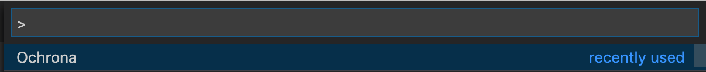
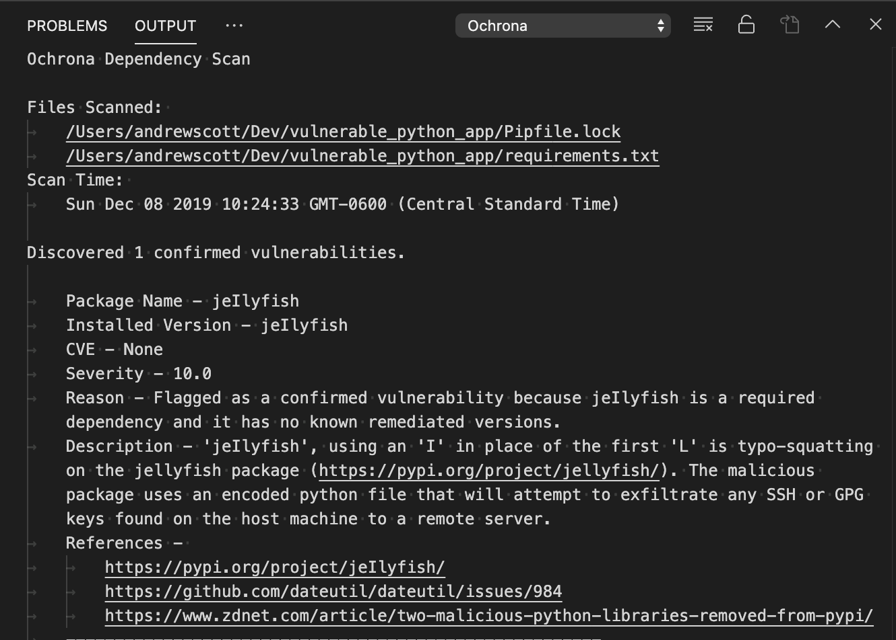
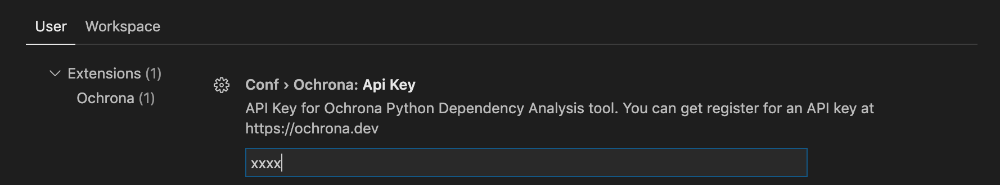
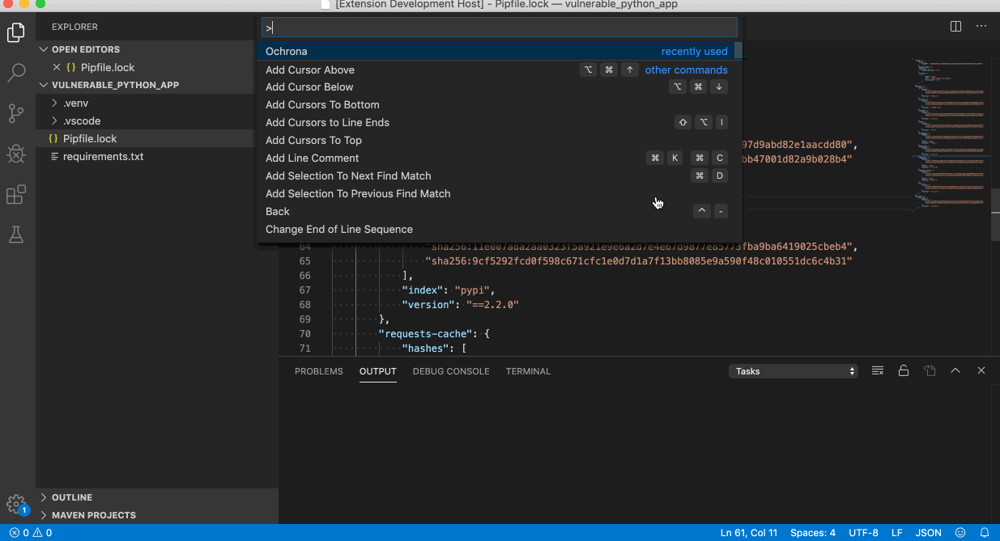

# Ochrona

This plugin is designed to operate as part of Ochrona Security, a solution for validating the dependencies used in python projects.

Ochrona requires a license to operate. We offer a free-tier license which allows up to 25 scans per month. You can sign up for an API key at https://signup.ochrona.dev.

Learn more at [Ochrona.dev](https://ochrona.dev) or view our comprehensive [documentation portal](https://docs.ochrona.dev).

## Usage

This Extension adds the `Ochrona` command which will detect all known python dependencies files and check them against Ochrona's repository of known python vulnerabilities. 

In the command palette (`CMD` + `SHIFT` + `P`), type `Ochrona`.

By default `Ochrona` will also run when you modify and save any python dependency files (listed below).

## Features

Ochrona supports the following file types:
- `*requirements*.txt`
- `Pipfile.lock`
- `poetry.lock`
- `tox.ini`
- `environment.yml`

A warning is displayed if a vulnerability is discovered.

A brief report is included in the VS Code Output tab for any discovered vulnerabilities.

You can re-run the plugin by clicking the Ochrona Status Bar Icon.

## Extension Settings

An Ochrona API key is required for use of this extension. You may register for a free license at [Ochrona.dev](https://ochrona.dev).

To set this open the VS Code Settings (Code -> Preferences -> Settings) or (`CMD` + `,`)

## Demo

## Release Notes

## [0.2.1]
- Documentation updates

## [0.2.0]

- Added support for scanning dependency files on file save.
- Added support for `tox.ini` files.
- Added support for `environment.yml` files.

### 0.1.0

- Add support for new Authentication provider
- Use path.normalize for windows path support

### 0.0.6

- Short-circuit run if no files are found.

### 0.0.5

- Added support for `poetry.lock` files.

### 0.0.4

- Fixed bug in requirements.txt file parsing.
- Adding warning when API Key is missing.
- Stop spinner if request fails.

### 0.0.3
- Added new invalid requirements.txt patterns.

### 0.0.2
- Updated for new Ochrona API.

### 0.0.1
- Support for checking `*requirement*.txt` and `Pipfile.lock` files for known python vulnerabilities.
